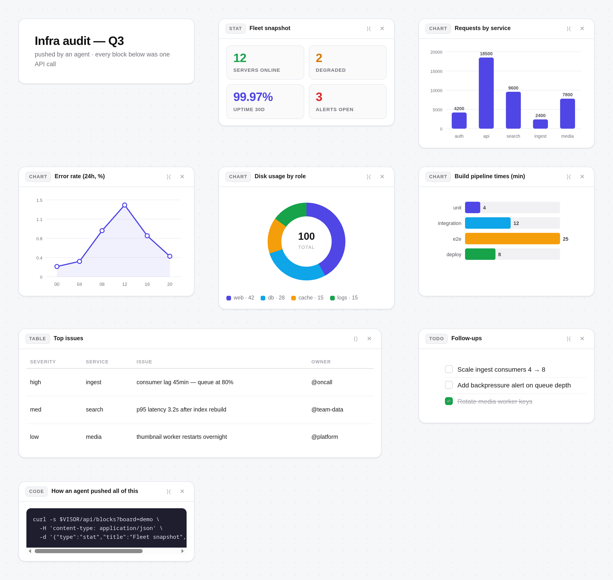
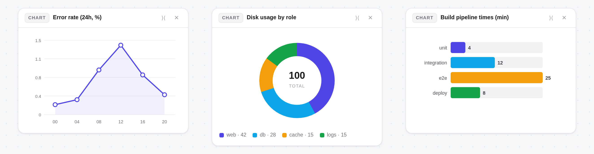

# Visor 🛰️

**A live holographic canvas for AI agents.**

Your agent gathers information — research findings, comparisons, voice samples,
KPIs, code — and pushes it to an infinite-canvas webpage you watch. Sections
update **in place over SSE** (the page is never rewritten), the canvas grows
without limits, you can pan/zoom, drag cards around, snap to a grid, and keep
unrelated topics on separate **boards** (tabs).

Built for agent workflows: every capability is one API call. Point any agent
(Claude Code, Hermes, OpenAI-compatible tools, a cron job, a script) at the
HTTP API and it can show you anything, anytime.



The board above (a sample "agent pushed me an audit" scenario) is one page:
KPI cards, four chart types, a wide table, a clickable todo list, and a code
block — all in place over SSE, no reload.

```
┌─────────────┐   POST /api/blocks   ┌──────────────────────────────┐
│  your agent │ ───────────────────► │  visor (port 8900, Docker)   │
│  (anything) │   boards, blocks,    │  SSE push → in-place updates │
└─────────────┘   media, focus       └──────────────┬───────────────┘
                                                    │
                                          ┌─────────▼─────────┐
                                          │  you: just watch  │
                                          │  http://:8900     │
                                          └───────────────────┘
```

## Why it exists

Agents are great at *finding* things and bad at *showing* them. Before visor,
"show me" meant: a wall of terminal output, a markdown dump, or a screenshot
I had to open manually. Visor is a persistent surface the agent writes to —
todos you can click, tables you can compare, audio you can A/B, charts you can
hover — while you do something else.

## Features

| | |
|---|---|
| **Blocks** | `section`, `text` (markdown), `todo` (clickable checklist), `table`, `stat` (KPI cards), `chart` (bar/line/donut/hbar SVG with hover tooltips), `code`, `image`, `audio` (labeled rack + *play in sequence* — built for A/B comparisons), `video`, `html` (raw markup) |
| **Boards** | named, switchable tabs; create/rename/delete; per-board camera position; block counts in tabs |
| **Canvas** | infinite pan/zoom, drag cards, snap-to-grid toggle (G), one-click auto-align (⇧G), double-click to focus a card, fit view, **minimap** (M, click/drag to recenter), **select + arrow-key nudge** (Shift = grid step), **wide cards** (`w:2`), **connectors** — drag a card's edge dot to another card (or push `links` via the API) for curved labeled arrows that follow their cards; click a link to select, Del or ✕ removes it |
| **Live updates** | SSE — blocks appear/update/remove in place; the agent can PATCH one block (e.g. bump a counter) without touching the rest; **auto-resync after a server restart** (events missed while down are re-fetched) |
| **Export** | any board → standalone offline HTML snapshot (E or the tab's ↧) that keeps layout, charts, connectors, and media; **PNG snapshot** of the whole board (P or the tab's ▣), up to 2x scale |
| **State** | JSON store on a Docker volume; survives reboots (`restart: unless-stopped`) and image rebuilds; media files staged into `data/media/` |
| **Zero dependencies** | server = Python stdlib; client = one HTML file, no framework, no chart library |



## Quick start (you)

Requires: Docker (or just Python 3.9+ for a bare run).

```sh
git clone https://github.com/samundra0/visor.git
cd visor
docker compose up -d          # builds + starts, http://localhost:8900
```

Open **http://localhost:8900** — you'll see the (empty) canvas. If the server
can't save blocks with a permission error, your uid isn't 1000: set
`VISOR_USER=$(id -u):$(id -g)` and rebuild. Then give your agent the setup
instructions in [docs/agent-setup.md](docs/agent-setup.md) and ask it to show
you something.

Bare Python (no Docker):

```sh
python3 server.py             # serves :8900, state in ./data
```

CLI (talk to it by hand):

```sh
python3 visor.py boards
python3 visor.py board new "GPUaaS"
python3 visor.py --board gpuas section "Fleet investment" "Datahub · June 2026"
python3 visor.py --board gpuas stat "Snapshot" "560 GB:VRAM:ok;\$117K:CAPEX:warn"
python3 visor.py --board gpuas chart "Revenue" --kind bar --labels "L4;BSE;H100" --values "10;37;17"
python3 visor.py --board gpuas audio "Voices" "peter ref:/path/a.wav;miles clone:/path/b.wav"
python3 visor.py list
```

## Pointing your agent at it

**MCP (Claude Code, OpenCode, Codex, Antigravity — anything MCP-capable):**
zero-dependency MCP server included (`mcp/server.py`, Python stdlib only).
It exposes `visor_push` + `visor_boards` as first-class tools and, on any
tool call, auto-starts the Docker container if it's down
(`VISOR_AUTO_START=0` disables):

```sh
# Claude Code
claude mcp add visor -- python3 /path/to/visor/mcp/server.py

# OpenCode  (opencode.json)
#   "mcp": { "visor": { "type": "local",
#     "command": ["python3", "/path/to/visor/mcp/server.py"], "enabled": true } }

# Codex CLI  (~/.codex/config.toml)
#   [mcp_servers.visor]
#   command = "python3"
#   args = ["/path/to/visor/mcp/server.py"]
```

Env for the MCP server: `VISOR_URL` (default `http://127.0.0.1:8900`),
`VISOR_HOME` (repo root, for staging local media; defaults to the repo).

**The agent only needs the API** (no MCP, no plugin): full copy-paste prompt
for any agent: [docs/agent-setup.md](docs/agent-setup.md). Note: pushing to a
board name that doesn't exist yet **auto-creates the board** — no setup step.

For **Hermes Agent** specifically there is a first-class plugin —
[hermes/](hermes/) — that registers a `visor_push` tool so the agent pushes
boards without learning the API by hand:

```sh
./hermes/install.sh           # copies the plugin into ~/.hermes/plugins/ and enables it
```

Then in any Hermes session: *"show me X on the visor"* — the agent calls
`visor_push` and the blocks appear live. The plugin auto-starts the Docker
container if it's down.

### The API in 20 seconds

```
POST /api/blocks?board=<id>
  {"type":"stat","title":"KPIs","data":{"items":[{"value":"42","label":"users","tone":"ok"}]}}
  → 200 {"id":"9f3ab12cd4", ...}          (block appears on the canvas)

PATCH /api/blocks/<id>?board=<id>
  {"data":{"items":[{"value":"43",...}]}}  (that one block updates in place)

GET /api/state?board=<id>      → full board state
GET /api/boards                → [{id,title,blocks,ts}, ...]
POST /api/boards {"title":"X"} → create
PATCH /api/boards/<id> {"title":"Y"}
DELETE /api/blocks/<id> | /api/boards/<id>
POST /api/clear?board=<id>     {"type": "table"?}   (wipe board, optionally by type)
POST /api/meta?board=<id>      {"title":"..."}      (board title)

POST   /api/links?board=<id>   {"from":"<blockId>","to":"<blockId>","label":"?"}
                                          -> 200 {"id":"lk..."} (curved arrow between
                                          the two blocks; 409 if already linked)
PATCH  /api/links/<id>?board=<id>  {"label":"..."}   (rename)
DELETE /api/links/<id>?board=<id>
                                          (links prune themselves when either
                                          endpoint block is deleted or the board
                                          is cleared)
GET /media/<file>              → staged media (the server copies files for you
                                 if you write into data/media/ yourself)
```

All SSE events carry the board id, so multiple boards update the same open page
without crosstalk. Every block payload accepts `x`, `y`, `w` (width, 1–3
columns) — omit them and the client auto-flows a 3-column shelf layout that
respects the grid.

`focus: true` in a POST centers the camera on that block (great for pushing a
video to a busy board).

### Connectors (links between blocks)

Links are board-level relations — `GET /api/state` includes `links: [...]`.
They render as curved indigo arrows with arrowheads and optional labels, on an
SVG layer that pan/zooms with the canvas and **follows their cards
automatically** (drag a card and every attached arrow re-routes; the camera
never moves). Users can also create links by hand: hover a card and drag one
of its four edge dots onto another card. Agents create them via the API —
push the blocks first, then link by the returned ids (the `links` param of
`visor_push` / the MCP tool does exactly this in one call). Deleting a block
prunes its links server-side, so stale arrows never linger.

### Example: an audio A/B comparison (real payload)

```json
{"type":"audio","title":"Output A vs B","data":{"items":[
  {"label":"variant A — baseline","src":"/path/baseline.wav","note":"before the change"},
  {"label":"variant B — candidate","src":"/path/candidate.wav","note":"after the change"}
]}}
```

Renders as labeled players with a **▶ play all in sequence** button — handy
for any side-by-side comparison: TTS clones vs references, two renders of the
same mix, model outputs before/after a prompt tweak.

## Development

```
server.py        stdlib HTTP server: state store, SSE, media, boards, links
index.html       the whole client (canvas, blocks, charts, links, boards UI)
visor.py         CLI (blocks, boards, links)
Dockerfile       python:3.12-alpine, stateless (state in ./data volume)
docker-compose.yml  restart: unless-stopped; VISOR_USER env for your uid:gid
hermes/          Hermes plugin (visor_push tool, incl. links) + install.sh
docs/agent-setup.md  the prompt to give any agent
docs/design/         historical design notes (e.g. the v1.4 connectors spec)
scripts/smoke.py end-to-end smoke test against a running :8900
.github/workflows/ci.yaml  builds the image and runs the smoke test on every push
data/.gitkeep    keeps the bind-mount dir in the repo so a fresh clone
                 creates it owned by the cloner (Docker would create it as
                 root → PermissionError on first start; see CHANGELOG 1.4.1)
```

Rebuild after changes: `docker compose build -q && docker compose up -d`.
(If the container already exists, `docker compose up -d` won't pick up the
new image — `docker rm -f visor` first, then up.)

CI lints the client JS automatically (extracts the `<script>` blob and
checks it — a single syntax error silently kills the whole page). Same
check locally if you want it before a rebuild:

```sh
node -e 'const h=require("fs").readFileSync("index.html","utf8");
new Function(h.match(/<script>([\s\S]*)<\/script>/)[1]);console.log("ok")'
```

Test: `python3 scripts/smoke.py` (server must be running) — boards, blocks,
links CRUD, error codes, SSE, media, exports. Same suite runs in CI.

Environment:

| var | default | meaning |
|---|---|---|
| `VISOR_DATA` | `./data` (host) / `/data` (container) | store + media dir |
| `VISOR_PORT` | `8900` | listen port (`HOLO_PORT` accepted as legacy alias) |
| `VISOR_USER` | `1000:1000` | uid:gid the container runs as (compose) — set this to your own uid:gid if your files aren't owned by 1000 (check with `id -u`/`id -g`), otherwise the server can't write `data/` |
| `VISOR_HOME` | repo root (parent of `mcp/`) | project root for the Hermes plugin + media staging |

## Design notes & honest limits

- **Light theme, dot grid = world coordinates.** The grid is aligned to the
  canvas (it moves with pan/zoom), and snap/align use its exact 26px pitch —
  what you see is what you snap to.
- **Camera discipline.** The camera only moves on user input, the first block
  on an empty board, explicit `focus`, or Fit. In-place updates never reframe
  (this was a real bug that made dragging feel jumpy — see the client's SSE
  diff: content change → rebuild that card; position change → move it;
  otherwise no-op).
- **Single user, one process.** No auth (it's for localhost/LAN). One store
  file, written atomically under a lock. Concurrency beyond a few clients is
  not the design goal.
- **Media is copied, not streamed from your paths.** The plugin/CLI stage files
  into `data/media/` (the page can't read arbitrary local paths). URLs pass
  through untouched.
- **Raw `html` blocks are trusted** — same origin as the canvas. Use them for
  layouts the typed blocks can't express (and the agent should prefer typed
  blocks otherwise).

## License

MIT — do what you want, no warranty. See [LICENSE](LICENSE).
